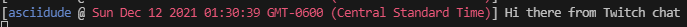

# MAKE SURE TO READ THIS, OR YOU WILL GET ERRORS

## Chatty

Chatty is a Twitch bot that was created primarily for new developers that may not want to
go through the process of creating a twitch bot by hand. It is also for people that just don't know
how to code.

## Configuration and Setup

```json
{
    "login_username": "xxxxxxxx",
    "login_password": "oauth:xxxxxxxxxxxxxxxxxxxxxxxxxxxxxx",

    "enabledModules": {
        "commands": [
            true,

            {
                "command_name": "!date",
                "responses": ["{TIME.DATE}"],
                "response_options": {
                    "type": "action"
                }
            },

            {
                "command_name": "!time",
                "responses": ["{TIME.HH_MM_SS}"],
                "response_options": {
                    "type": "action"
                }
            },

            {
                "command_name": "!userinfo",
                "responses": [
                    "{USER.USERNAME}'s information",
                    "-----------------------------",
                    "ID: {USER.ID}",
                    "AKA: {USER.DISPLAY_NAME}",
                    "Moderator: {USER.MOD}",
                    "Watching: {CHANNEL}"
                ],
                "response_options": {
                    "type": "action"
                }
            }
        ],

        "init": {
            "console": {
                "enabled": true,
                "message": "Hello world... o_o",
                "styling": {
                    "color": "blue",
                    "style": "bold"
                }
            },

            "message": {
                "enabled": true,

                "messages": [
                    "Loaded up, nice."
                ],

                "message_options": {
                    "type": "action",
                    "channel": "asciidude"
                }
            }
        },

        "chatLog": true,
        "debug": false,
        "selfCommands": true
    },

    "channels": ["asciidude"]
}
```

## Documentation

### Initialization

First clone the GitHub:

```properties
git clone https://github.com/asciidude/Chatty
```

Then, download all the node modules using yarn or something, doesn't matter.

```properties
yarn
```

Copy the example from the documentation and put it in a **bot.json** file - *it MUST be named bot.json*.

Finally (after configuration), run the bot:

```properties
yarn start
```

### Logging In

To login you must already have a Twitch account, then you must go to
[twitchapps.com/tmi](https://twitchapps.com/tmi) when logged into your Twitch account on the
same browser and get a password.

Once you retrieved a password, input your Twitch username in `login_username` and the assigned
password from [twitchapps.com/tmi](https://twitchapps.com/tmi) in `login_password`.

### Modules

#### Commands

**The first index of the array determines if commands are enabled or not.**

All commands should be structured like this, if they are not it may cause errors.

```json
{
    "command_name": "input",
    "responses": ["output 1", "output 2"],
    "response_options": {
        "type": "action"
    }
}
```

This may seem like a lot, so let's break it down...

`command_name` is what is recieved from Twitch chat and processed, it must match the command_name exactly, so it is best to use a prefix for commands (or just add a toLowerCase function in the source code)

`responses` Is what is sent back in response, it CAN be multiple and the amount of messages you can send is unlimited, if you are API banned it is not my fault though (lol) - this was made possible because newlines are impossible in Twitch.

`response_options.type` This is what the message looks like, if that makes sense. You can choose either "chat" which simply sends a normal message, or you can choose "action" which sends an italicized message.

**Reminder, response queries are only avaliable in commands.**

#### Initialization Notification

The initialization notification is not very important though it is extremely useful in debugging,
so it is reccomended to have it. Your initialization file should be structured like this to avoid any
errors.

```json
"init": {
    "console": {
        "enabled": true,
        "message": "Hello world... o_o",

        "styling": {
            "color": "blue",
            "style": "bold"
        }
    },

    "message": {
        "enabled": true,
        "messages": [
            "Loaded up, nice.",
            "Hi everyone."
        ],

        "message_options": {
            "type": "action",
            "channel": "asciidude"
        }
    }
}
```

Once again, let's break this down...

`console.enable` Enable or disable logging to the console when the bot is online

`console.message` What to log on initialization

`console.styling` See styling options [here](https://www.npmjs.com/package/colors) - this was to
make up for the no response queries

`console.styling.color` The color of the text

`console.styling.style` The style of the text

`message.enabled` Enable or disable messaging a streamer's chat when bot has initialized

`message.messages` The messages to send when the bot has initialized

`message.message_options.type` Literally the exact same as commands type

`message.message_options.channel` The streamer to send the message on initialization to (works on offline chats as well)

#### Chat logs

Chat logs look like this in the console:

</img>

It essentially just logs whatever is sent to the Twitch chat.

#### Debug mode

Debug mode logs any event with the Twitch API to the console, this is usually not needed - considering
the simplicity of this, but oh well. If you need it or just wanna see, go ahead.

To enable debug mode just switch `debug` to `true` in your modules section of the bot file.

#### Self commands

These are if you can run commands if you are on the same account as the bot is running on. Usually, you should leave this on.

To disable change `selfCommands` to any value other than `true`.

### Channels

These are the Twitch channels you want your bot to connect to (yes, unfortunately, you need to make a
list of streamers to connect to).

An example would be:

`channels: ["asciidude", "and", "some", "other", "channels"]`

### Response Queries

Response queries are the `{OPTION}` things you see in the example. Below is a complete list of them.

#### Time

```
TIME.DATE: Get the date in standard form with the time in military time (eg. Sun Dec 12 2021 00:42:03 GMT-0600 (Central Standard Time))
TIME.HH_MM_SS: Get the time in hh:mm:ss format (eg. 05:20:30)
```

#### User

```
USER.DISPLAY_NAME: Get the user's display name
USER.BADGE_INFO: Get the user's badge information
USER.USERNAME: Get the user's username
USER.COLOR: Get the user's assigned color by Twitch
USER.BADGES: Get the user's badges
USER.BITS: Get the user's bits
USER.EMOTES: Get the user's emotes
USER.FLAGS: Get the user's flags
USER.ID: Get the user's Twitch ID
USER.MOD: Get if the user is a mod or not
USER.SUBSCRIBER: Get if the user is subscribed or not
USER.TURBO: Get if the user is turbo or not
```

#### Channel

```
CHANNEL: Get the username of the streamer
```

#### Message

```
MESSAGE.TYPE: Get the message type
```

#### Room

```
ROOM.ID: Get the room ID
```
